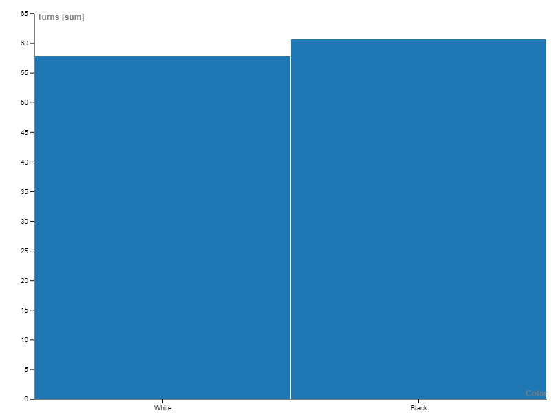
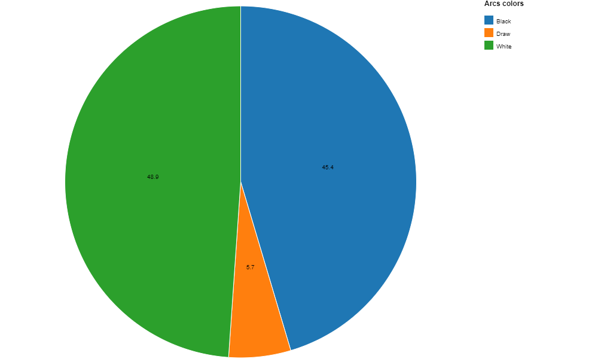
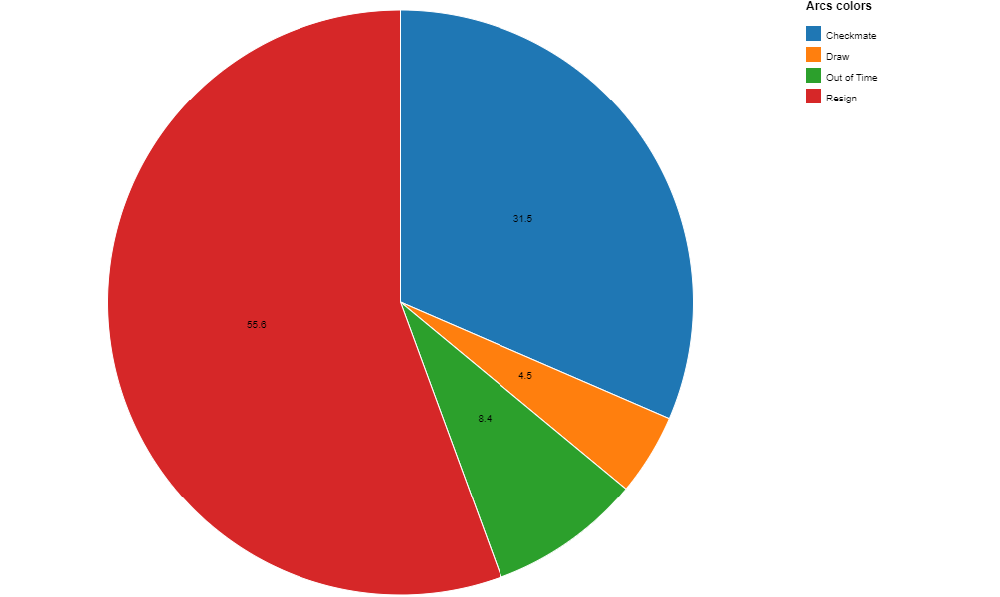
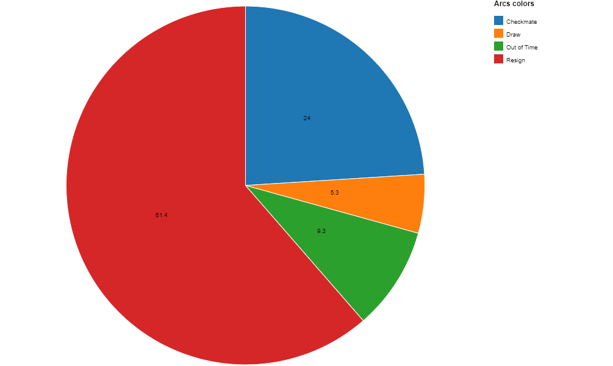
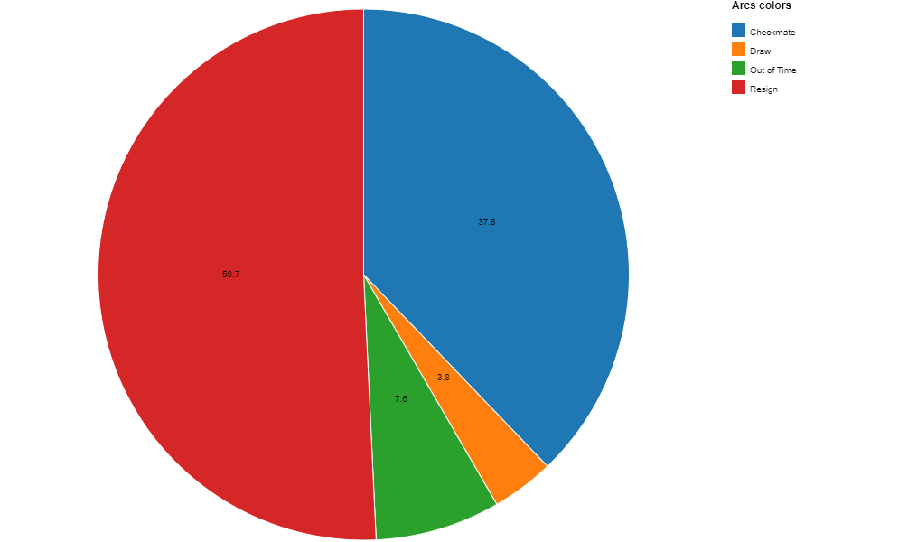
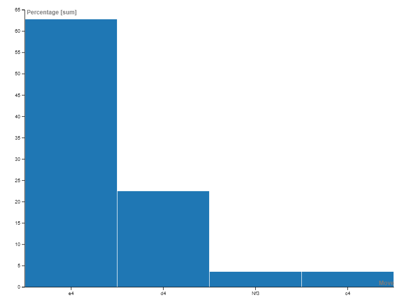
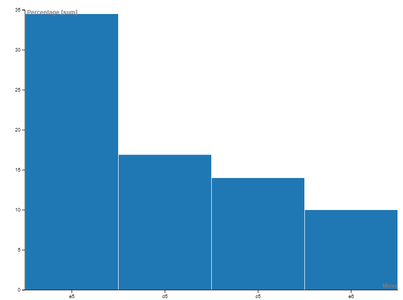

# chess-dataset-analysis

## Summary
I perform a data analysis on a dataset comprised of 20,058 games played on the website Lichess. I will tackle questions related to:
- The advantage if a player starts with the white pieces
- How the games ended 
- Common opening moves

In each of these sections, I will be taking elo, starting color and number of turns to see how each affect the outcome.

## Overview of the Dataset
- Total Games: 20,058
- Total Rated Games: 16,155
- Average Game Length: 60.4 turns (30.2 turns per player)
- Average Rating: 1,593 elo

## White & Black Wins 

We can see from this pie chart that the the player with the white pieces wins 50% of the time while the plater with the black pieces only wins 45% of the time. This result is naturally expected as the player with the white pieces has the first move and dictates the opening portion of the game. 

## White & Black Wins & Turns

Following up from the previous section, we can see that whenever the player with the white pieces wins, they win on average in 57.8 turns (28.9 moves per player) while whenever the player with the black pieces wins, they win on average in 60.7 turns (30.35 moves per player). This is again expected as the player with the white pieces is usually the 'attacking side' while the player with the white pieces is usually the 'defending side'.

## Elo and Color Advantage
In this section we will consider how elo affects if at all the past metrics. We will use 1600 elo as the break point as it is close to the average rating of the players. Note: I will be taking the average between the two players, so if player 1 has an elo of 1700 and player 2 has an elo of 1550, the game will be considered above 1600 elo.

## Above 1600
- Number of games: 9,146

### White and Black Wins

As we can see the higher elo games have more draws and a decrease in the percentage where the player with the white pieces wins. This makes sense as players gain more experience, they get better at drawing with black pieces and defending with the black pieces.

### White & Black Wins & Turns

It is evident that the higher elo we get, the average turns per game is longer with white winning in 62 turns (31 moves per player) and black winning in 65.2 turns (32.6 moves per player).

## Below 1600
- Number of games: 10,912

### White and Black Wins

As we can see the lower elo games have less draws and more conclusive wins with the white pieces. This again makes sense as lower elo players struggle with drawing games and defending with the black pieces.

### White & Black Wins & Turns

It is evident the lower elo we get, the average turns per game is shorter with white winning in 54.3 turns (27.15 moves per player) and black winning in 56.9 turns (28.45 moves per player).

## Conclusion for 'White Player Advantage'
It is a common trend throughout these graphs that the player with the white pieces has an advantage in all elos, however, that advantage is diminished the higher the players elos. White also has to work harder for the win in higher elos as it takes longer turns to win, but in all elos, black must work harder to win that white.

## How Games Ended

From the pie chart, we can see that most games end in a player resigning followed by checkmate, out of time and draw in that order. We will mainly be comparing in terms of elo in this section.

## Elo and How Games Ended
In this section we will consider how elo affects if at all how the games end. We will use 1600 elo as the break point as it is close to the average rating of the players. Note: I will be taking the average between the two players, so if player 1 has an elo of 1700 and player 2 has an elo of 1550, the game will be considered above 1600 elo.

## Above 1600
- Number of games: 9,146

What is surprising to see is that there are a lot more resignations from higher elo players and less checkmates delivered. Out of time is still relatively unchanged which is suprising as I thought the higher the elo, the less time pressure would affect the outcome of the game.

## Below 1600
- Number of games: 10,912

We see there are a lot less resignations and a lot more checkmates. This makes sense intuitively as there are more conclusive games in lower elo games.

## Conclusion for How Games Ended
The most surprising part about this comparison was that in lower elo games, people tend to give up less that people in higher elos. This may be due to the fact that lower elo players do not know when they are lost or they are counting on their opponent to make another mistake(which is likely). While in higher elo games, it is unreliable to count on your opponent to make a mistake so it would be logical to just resign once you figure out you are losing.

## Popular Opening Moves
This section will explore some common openings for both the white and black pieces
## White Openings

The most common opening for white is undoubtly e4 followed by d4, Nf3 and c4. 
### e4
- Italian
- Scotch
- Ruy Lopez
- King's Gambit
- Vienna 
### d4
- Queen's Gambit
- Slav
- Catalan
### Nf3
- Three Knights
- Four Knights
- Lead to many e4 positions 
### c4
- English

## Black Openings

For black, common first moves include e5, d5, c5 and e6.
### e5
- Mirror Positions
- Open Game
### d5
- Queen's Gambit Accepted
- Queen's Gambit Declined
### c5
- Sicillian 
### e6
- French
